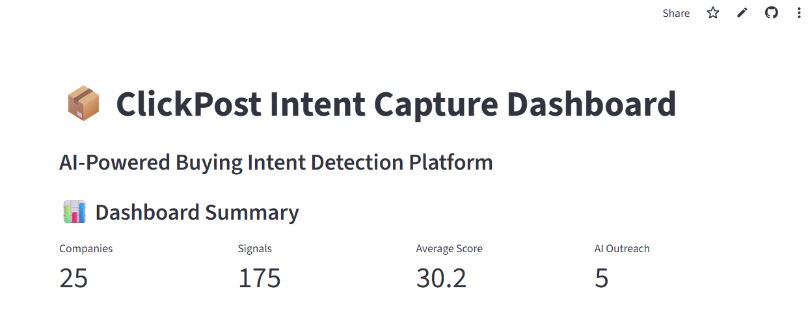
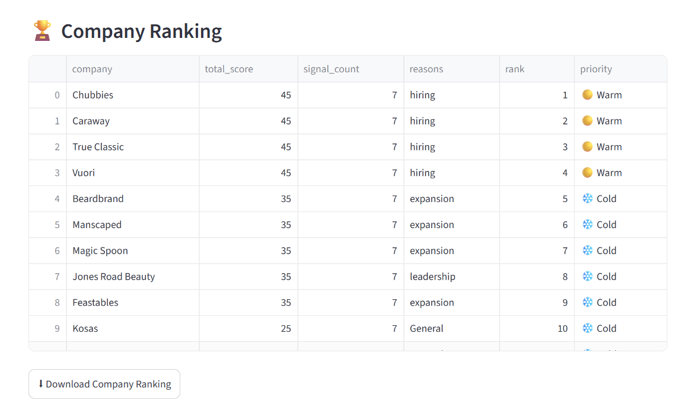
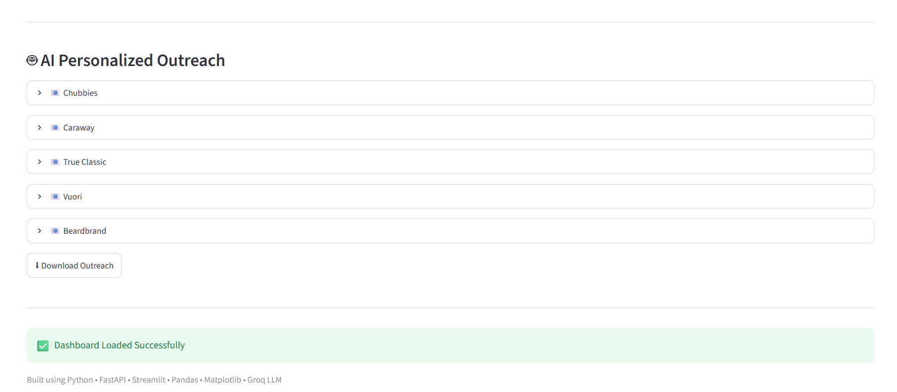

# 📦 ClickPost Intent Capture AI Platform

> AI-powered Buying Intent Detection Platform that identifies high-intent companies from public signals, ranks leads, and automatically generates personalized outreach using LLMs.

---

## 🚀 Live Demo

### 🌐 Streamlit Dashboard
https://clickpost-intent-capture-ai-av4xntjk4qzp6bqmhvjpdf.streamlit.app/

### ⚡ FastAPI Backend
https://clickpost-intent-capture-ai-backend-api.onrender.com/docs

### 📄 API Docs
https://clickpost-intent-capture-ai-backend-api.onrender.com/docs

---

# 📸 Screenshots

## Dashboard

> Replace with your dashboard screenshot



---

## Company Ranking



---

## Intent Signals


---

## AI Personalized Outreach



---

# 🎯 Problem Statement

Sales teams spend countless hours identifying companies that may be ready to purchase logistics and shipping solutions.

This platform automates that process by:

- Collecting public buying intent signals
- Ranking companies based on intent
- Explaining why companies were scored
- Generating AI-powered personalized outreach

---

# ✨ Features

✅ Public signal collection

✅ Buying intent detection

✅ Explainable AI scoring

✅ Company ranking

✅ Personalized AI email generation

✅ Personalized LinkedIn generation

✅ FastAPI REST API

✅ Interactive Streamlit Dashboard

✅ Docker Deployment

---

# 🏗 System Architecture

```text
                  Public Sources
             (News / RSS Feeds)

                      │
                      ▼

         Signal Collection Pipeline
        (feedparser + requests)

                      │
                      ▼

           Intent Signal Extraction

                      │
                      ▼

            Company Score Engine

                      │
                      ▼

      AI Outreach Generator (Groq LLM)

          ┌──────────────┴──────────────┐
          ▼                             ▼

 Company Ranking CSV          Outreach CSV

          │
          ▼

     FastAPI Backend

          │
          ▼

  Streamlit Dashboard
```

---

# 🧠 AI Workflow

```text
Company List
      │
      ▼

Collect Public Signals
      │
      ▼

Intent Detection
      │
      ▼

Score Companies
      │
      ▼

Rank Companies
      │
      ▼

Generate AI Email
      │
      ▼

Generate LinkedIn Message
      │
      ▼

Dashboard + REST API
```

---

# 📂 Project Structure

```text
clickpost-intent-capture-ai/
│
├── api/
│   ├── __init__.py
│   └── app.py                     # FastAPI Backend
│
├── dashboard/
│   ├── __init__.py
│   └── app.py                     # Streamlit Dashboard
│
├── scraper/
│   ├── __init__.py
│   └── signal_collector.py        # RSS / News Signal Collection
│
├── scoring/
│   ├── __init__.py
│   └── score_engine.py            # Company Scoring Logic
│
├── generator/
│   ├── __init__.py
│   ├── llm_generator.py           # AI Email Generator
│   ├── outreach_generator.py      # LinkedIn Generator
│   └── save_outreach.py
│
├── signals/
│   ├── __init__.py
│   └── intent_rules.py            # Buying Intent Taxonomy
│
├── utils/
│   ├── __init__.py
│   └── helpers.py
│
├── data/
│   │
│   ├── raw/
│   │   ├── companies.csv
│   │   └── sample_accounts.csv
│   │
│   └── output/
│       ├── company_ranking.csv
│       ├── news_signals.csv
│       └── personalized_outreach.csv
│
├── .devcontainer/
│   └── devcontainer.json
│
├── .dockerignore
├── .gitignore
├── .env.example
├── Dockerfile
├── docker-compose.yml
├── config.py
├── main.py                        # Run Complete AI Pipeline
├── requirements.txt
├── README.md
```

---

# ⚙ Tech Stack

### Backend

- FastAPI
- Uvicorn

### Frontend

- Streamlit

### AI

- Groq LLM

### Data

- Pandas
- NumPy

### Data Sources

- RSS Feeds
- News Sources

### Deployment

- Docker
- Render
- Streamlit Cloud

---

# 📊 Output Files

Generated automatically

```
company_ranking.csv

news_signals.csv

personalized_outreach.csv
```

---

# REST API

## Home

```
GET /
```

Returns API status.

---

## Company Ranking

```
GET /ranking
```

---

## Intent Signals

```
GET /signals
```

---

## AI Outreach

```
GET /outreach
```

---

# 🚀 Installation

Clone repository

```bash
git clone https://github.com/prassu02/clickpost-intent-capture-ai.git

cd clickpost-intent-capture-ai
```

Install dependencies

```bash
pip install -r requirements.txt
```

Create environment

```env
GROQ_API_KEY=YOUR_KEY
```

Run Pipeline

```bash
python main.py
```

Run FastAPI

```bash
uvicorn api.app:app --reload
```

Run Streamlit

```bash
streamlit run dashboard/app.py
```

---

# 🐳 Docker

Build

```bash
docker build -t clickpost-ai .
```

Run

```bash
docker run -p 8000:8000 clickpost-ai
```

---

# 📈 Future Improvements

- Reddit integration
- LinkedIn signal extraction
- Twitter/X integration
- Real-time scheduling
- PostgreSQL database
- Authentication
- Vector database
- Multi-agent workflow
- LangGraph integration

---

# 👨‍💻 Author

**Prasanna Kumar**

AI Engineer | Machine Learning Engineer | Data Scientist

GitHub

https://github.com/prassu02

LinkedIn

https://www.linkedin.com/in/k-prasanna-kumar/

---

# 📜 License

MIT License

---

⭐ If you found this project useful, consider giving it a star.
